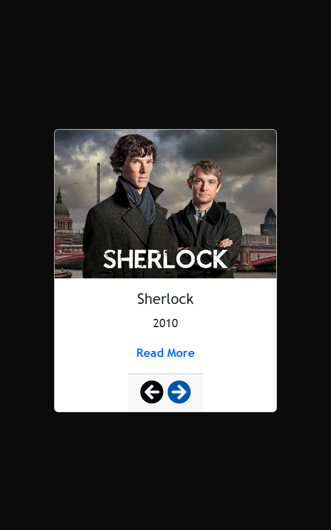
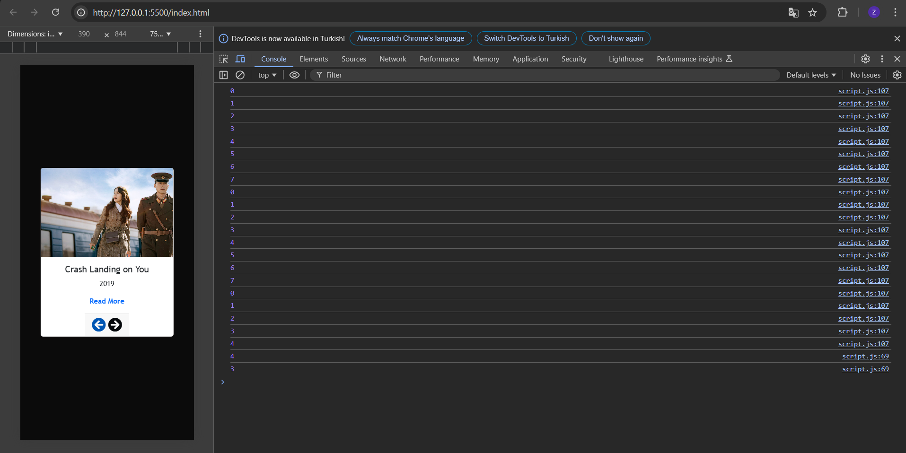

# Javascript-slider
JavaScript kullanılarak hazırlanmış, sırayla veya rastgele slayt gösterimi yapabilen basit bir slider uygulaması

## Proje Konusu

Bu proje, popüler film ve dizilerin görsellerini ve bilgilerini dinamik bir şekilde göstermek için geliştirilmiş basit bir slider uygulamasıdır. Kullanıcılar, sol ve sağ ok ikonları ile içerikleri gezebilir, ayrıca otomatik kaydırma seçeneğiyle içerikler sırasıyla veya rastgele gösterilebilir.

## Neden Geliştirildi, Motivasyon

Bu uygulamayı geliştirme motivasyonum, JavaScript ve DOM manipülasyonu konularındaki becerilerimi geliştirmekti. Web geliştirme konusunda daha fazla deneyim kazanmak ve dinamik içerik gösterimi hakkında bilgi edinmek istedim. Aynı zamanda uygulama ile kullanıcı etkileşimlerini yönetmeyi öğrenmek de hedeflerim arasındaydı.

## Ne Öğrendim?

Bu projeyi geliştirirken aşağıdaki konularda bilgi ve deneyim kazandım:

- **HTML, CSS ve JavaScript ile temel web geliştirme becerileri.**
- **DOM manipülasyonu** ile sayfa üzerinde dinamik içerik değişikliği yapabilme.
- **Interval kullanımı** ile otomatik kaydırma fonksiyonlarını yönetme.
- **Event Listener kullanımı** ile kullanıcı etkileşimlerini dinleyip yanıt verme.
- **CSS ile basit tasarım prensipleri ve Responsive Design.**

## Ekran Görüntüleri

